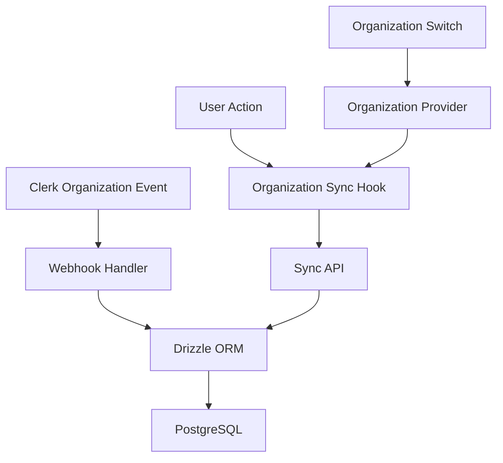

# Organization Synchronization

This document describes how Clerk organizations are synchronized with the database using Drizzle ORM.

## Overview

Organizations are synced from Clerk to our PostgreSQL database through multiple mechanisms:
1. **Webhooks**: Real-time sync when organizations are created/updated in Clerk
2. **API Sync**: Manual sync when users access the application
3. **Organization Provider**: Automatic sync when organization context changes

## Implementation Details

### 1. Webhook Handler
**File**: `/app/api/webhooks/clerk/route.ts`

Handles the following events:
- `organization.created`
- `organization.updated`
- `organizationMembership.created`
- `organizationMembership.updated`
- `organizationMembership.deleted`

All operations use **Drizzle ORM** for database access:
```typescript
const db = getDb()
await db
  .insert(organizations)
  .values({ id, name, slug })
  .onConflictDoUpdate({ /* ... */ })
```

### 2. Organization Sync Hook
**File**: `/hooks/use-organization-sync.ts`

React hook that syncs organization data when:
- User switches organizations
- Organization data changes
- User logs in with an organization context

### 3. Organization Sync API
**File**: `/app/api/organizations/sync/route.ts`

Protected API endpoint that:
- Verifies user authentication via Clerk
- Uses **Drizzle ORM** for database operations
- Upserts organization data with conflict handling

### 4. Organization Provider
**File**: `/components/providers/organization-provider.tsx`

Wraps the application to ensure organizations are synced globally.

## Database Schema

### Organizations Table
- `id`: text (Clerk organization ID)
- `name`: text
- `slug`: text
- `created_at`: timestamp
- `updated_at`: timestamp

### Organization Members Table
- `id`: UUID
- `organization_id`: text (references organizations.id)
- `user_id`: text (references profiles.id)
- `role`: enum ('owner', 'admin', 'member', 'viewer')
- `joined_at`: timestamp

## Migration
**File**: `/supabase/migrations/20240103000000_clerk_organizations.sql`

Converts organization IDs from UUID to text to match Clerk's format.

## Data Flow



## Important Notes

1. **Always use Drizzle ORM** for database operations
2. Organization IDs are stored as text (Clerk format)
3. Webhooks provide real-time sync
4. Manual sync ensures data consistency
5. RLS is currently disabled for development

## Testing

To test organization sync:
1. Create an organization in Clerk dashboard
2. Check database for synced organization
3. Add members to organization
4. Verify membership records in database

## Troubleshooting

### Organization not syncing
- Check webhook logs in Clerk dashboard
- Verify `CLERK_WEBHOOK_SECRET` is set (for production)
- Check browser console for sync API errors

### Membership not updating
- Ensure user profile exists before membership
- Check for unique constraint violations
- Verify role values are valid enum options

## Production Considerations

1. Enable webhook signature verification
2. Set up proper error handling and retry logic
3. Consider implementing a sync queue for reliability
4. Monitor sync performance and optimize queries
5. Enable RLS policies when ready for production